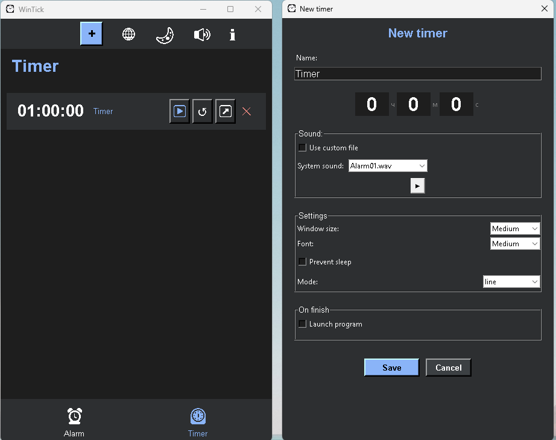

# ⏰ WinTick — Smart Alarm Clock

[EN] A smart productivity tool for remote workers and office staff. 
[CN] 智能闹钟：支持鼠标动作模拟以防止电脑休眠，具备多语言界面及自定义铃声功能。
[ES] Una herramienta de productividad inteligente para el trabajo remoto y la oficina.
[FR] Un outil de productivité intelligent pour le télétravail et le bureau.
[RU] Умный будильник для работы и дома. Имитирует движение мыши и запускает программы.

---

### 🌍 Supported Languages / 支持的语言
🇷🇺 RU | 🇺🇸 EN | 🇩🇪 DE | 🇫🇷 FR | 🇪🇸 ES | 🇨🇳 CN | 🇸🇦 AR

## ☕ Support the Developer / Apoyar el proyecto / Soutenir le projet / Поддержать проект / 支持项目
If you find WinTick useful, you can support further development via cryptocurrency:

| Currency | Network | Wallet Address |
| :--- | :--- | :--- |
| **USDT** | **TRC-20 (Tron)** | `THkgBiDGw6atBRoq6sX9FgEwQN2kiGseFT` |
| **BTC** | **Bitcoin** | `bc1queh5c2yy7vyg65wtrv4pdh0g2xmcjqm83x4wrr` |
| **USDT / ETH** | **ERC-20 (Ethereum)** | `0xC8880cF7eE8b1C35Cc08e67Bde17AbF70E554434` |
| **SOL** | **Solana** | `G6Myxn4bSzRZQKufQY8XwdPsEwkwrRJ9K4BXU2hbMMA` |

---

---

## 📥 Download / Скачать
Download the latest version here: [Releases](https://github.com/DigitalSubGate/WinTick_Project/releases/tag/v1.7)
---

## 👨‍💻 About the Author / Об авторе / 关于作者

**[EN]** Check out my other projects and premium services:
**[CN]** 查看我的其他项目和优质服务:
**[ES]** Mira mis otros proyectos y servicios premium:
**[FR]** Découvrez mes autres projets et services premium:
**[AR]** تحقق من مشاريعي الأخرى وخدماتي المميزة:
**[RU]** Посмотрите мои другие проекты и премиум-сервисы:

🚀 **[DigitalSubGate Official Website](https://github.io)**

---

